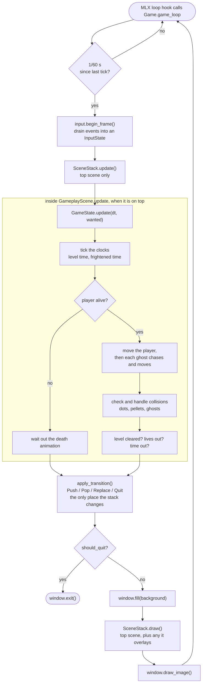

*This project has been created as part of the 42 curriculum by semebrah, strambus.*

# pacman

## Description

A Pac-Man clone in Python. Mazes come from an external A-Maze-ing package, graphics use MLX. N levels, four ghosts, power pellets, a time limit per level, a persistent top-10 highscore table, and a cheat mode

Loop: main menu > play > win or lose > enter name > back to menu.

## Instructions

Requires Python 3.10+. `make install` uses uv (installs it with pip if missing). `mlx` and `mazegenerator` are installed from the wheels in `wheels/`.

```
make install        # create .venv and install dependencies
make run            # python3 pac-man.py config.json
make debug          # run under pdb
make lint           # flake8, mypy
make lint-strict    # ruff, flake8, mypy --strict
make test           # pytest
make clean          # remove caches
```

Run by hand: `python3 pac-man.py <config.json>`

Controls: arrows or WASD to move, Space/Enter to select, P to pause, Esc to go back (quits from the main menu).

## Configuration

JSON file. Lines starting with `#` are comments. Unknown keys are ignored. Invalid or missing values fall back to the default with a message on stdout; the game never crashes on a bad config. If the top-level value is a list, it is taken as `levels`.

| key | default | meaning |
|---|---|---|
| `highscore_filename` | `"highscore.json"` | where highscores are stored |
| `lives` | `3` | starting lives (>= 1) |
| `points_per_pacgum` | `50` | score per dot |
| `points_per_superpacgum` | `50` | score per power pellet |
| `points_per_ghost` | `200` | score per eaten ghost |
| `level_max_time` | `90` | seconds per level; game over when it runs out |
| `levels` | one 10x10 level | list of `{"width", "height"}` |
| `invincibility_cheat` | `false` | ghosts cannot kill the player |
| `frozen_ghost_cheat` | `false` | ghosts do not move |
| `speedy_player_cheat` | `false` | faster player, speeds up each level |
| `seed` | `42` | maze seed for level 1; later levels are always random |

```
{
  # lines starting with # are ignored
  "lives": 3,
  "seed": 42,
  "levels": [
    { "width": 16, "height": 16 },
    { "width": 12, "height": 12 }
  ]
}
```

## Highscore

Stored as a JSON list of `{"name", "score"}` in the file named by `highscore_filename`, in the working directory. Top 10 only, sorted by score; on a tie the older entry keeps its place. Names are 1 to 10 characters, letters, digits and spaces. Scores are non-negative integers.

Loaded once at startup, saved when a game ends. Missing file: an empty one is created. Unreadable or invalid file: it is renamed to `<name>.bak` and the table starts empty. Saving writes a temp file then replaces the original, so a crash mid-write cannot corrupt it.

Why a JSON file: same format as the config, readable by hand, no extra dependency, and pydantic validates it for free (`src/core/highscore.py`).

## Maze Generation

`src/entities/maze.py` wraps `mazegenerator.MazeGenerator` from the assigned package, used as-is.

```
gen = MazeGenerator(size=(width, height))   # perfect=False is the package default
gen.generate(seed)                          # seed 0 or unset = random
gen.maze                                    # grid of ints
```

Each int is a 4-bit wall mask: N=1, E=2, S=4, W=8. `Maze` turns the grid into `Cell` objects with `n`, `e`, `s`, `w` links (`None` means wall). Actors only ever move along those links, so they cannot cross walls. Cells with value 15 (all walls) form the package's "42" block; the player spawns at its centre and no dots are placed inside its bounding box. Ghosts spawn in the four corners, power pellets in the corner cells.

Level 1 is generated with `seed` from the config, so it is the same maze every run. Every later level passes no seed and is random.

## Implementation

One frame, from the MLX hook to the presented image. The simulation runs inside
the active scene's `update()`, so every screen shares the same loop.



- Fixed 60 Hz tick driven by the MLX loop hook (`src/main.py`).
- Scenes on a stack (`src/core/scene_stack.py`): menu, gameplay, pause (overlay), game over, highscores, instructions. A scene returns a `Push`, `Pop`, `Replace` or `Quit` transition from `update()`.
- Game logic lives in `GameState` (`src/game_state.py`) and knows nothing about drawing. `GameView` (`src/ui/game_view.py`) renders it.
- Movement is grid-based: an actor moves between cell centres along corridor links; a requested turn is queued and applied at the next cell where it is possible.
- Ghosts pick, at each cell centre, the open direction closest to the player (farthest when edible), never turning back, with a small random chance to ignore that rule so they do not clump. Eaten ghosts respawn in their corner after a delay. Ghost speed rises every level.
- Level ends when all dots and pellets are eaten. Score and lives carry over. The game ends after the last level, when lives hit 0, or when the level timer runs out.
- Config and highscore files are validated with pydantic. Everything is typed and passes `mypy --strict`, `flake8` and `ruff`.

## General software architecture

```
pac-man.py                  entry point, calls src.main.main
src/main.py                 Game: window, input, tick loop, SceneStack
src/core/
  config.py                 Config, Level, ConfigLoader (pydantic)
  settings.py               constants: speeds, sizes, key bindings
  window.py                 MLX wrapper
  input.py                  key events -> Action, InputState
  scene.py, scene_stack.py  Scene base class and LIFO stack
  transitions.py            Push / Pop / Replace / Quit
  context.py                Context(config, highscore) shared by scenes
  highscore.py              HighScore, HighscoreItem
  font.py, image.py, sprite.py   asset loading and sprite animation
src/scenes/                 MenuScene, GameplayScene, PauseScene,
                            GameOverScene, HighScoreScene, InstructionsScene
src/game_state.py           GameState, GameStatus, GameResult
src/entities/
  maze.py                   Maze, Cell
  models.py                 Edible -> Actor, Location, Direction, Region
  player.py, ghost.py       Player(Actor), Ghost(Actor)
  pacgum.py                 Pacgum(Edible), SuperPacgum(Pacgum)
src/ui/                     GameView, theme, shared widgets
tests/                      pytest
```

A generated class diagram of the same code is in
[docs/code-map.md](docs/code-map.md).

`Game` owns the `SceneStack`, which builds scenes from a `Context`. `GameplayScene` owns one `GameState` and one `GameView`. `GameState` owns the `Maze`, the `Player`, the ghosts and the dots and advances them each tick. Entities never import scenes or UI.

## Project management

Built by two people over three weeks on
[github.com/pacmania42/pacman](https://github.com/pacmania42/pacman).

The subject was split into epics, each with a short prefix (`UI`, `GAM`,
`CFG`, `SPRITES`, ...). Every piece of work is an issue titled with that prefix,
cut to a size one person finishes in a sitting, and tracked on a GitHub Projects
board with the usual columns, Backlog / Ready / In progress / In review / Done,
where linked issues and pull requests move their own cards. The branch carries
both the issue number and the prefix, `20-ui-02-screen---game-over`, so the
branch list alone shows what is in flight. *(The board is private to the
organization; the issues and pull requests it tracks are public.)*

We split the code along the simulation/presentation seam: semebrah owns the
config loader, maze integration, actors, game state, collision, progression and
packaging; strambus owns the scene manager, input, screens, HUD, font
renderer, sprites, ghost chase strategies and highscore. That convention is why
`GameState` contains no drawing code.

Nothing reaches `main` except through a pull request reviewed by the other
person, no one merges their own work, with [CI](.github/workflows/ci.yml)
running `make lint` and `make test` on every push.

Full documents in [docs/](docs/):

- [project-timeline.md](docs/project-timeline.md), planned vs actual, and where we drifted
- [team-organization.md](docs/team-organization.md), who did what, and how work flowed
- [analysis-and-risks.md](docs/analysis-and-risks.md), technical choices, risks, blocking points
- [acceptance-tests.md](docs/acceptance-tests.md), test plan, bugs found and fixed

## Distributions
[pacman distribution on itch.io](https://pacmania42.itch.io/pacman)

## Resources

- [Game Programming Patterns - Game Loop](https://gameprogrammingpatterns.com/game-loop.html)
- [Game Programming Patterns - State](https://gameprogrammingpatterns.com/state.html)
- [pydantic documentation](https://docs.pydantic.dev/)
- [uv documentation](https://docs.astral.sh/uv/)
- [setuptools - Package Discovery](https://setuptools.pypa.io/en/latest/userguide/package_discovery.html)
- Font: [peaberry-pixel-font](https://emhuo.itch.io/peaberry-pixel-font)
- Sprites: [goblin scout](https://zneeke.itch.io/goblin-scout-silhouette), [monster pack](https://penusbmic.itch.io/monster-pack-i), [heart pack](https://gamedevshlok.itch.io/heartpack)

AI used to find bugs, fix docstring, to fix this README and generate base of project management files, analysis and graphs
