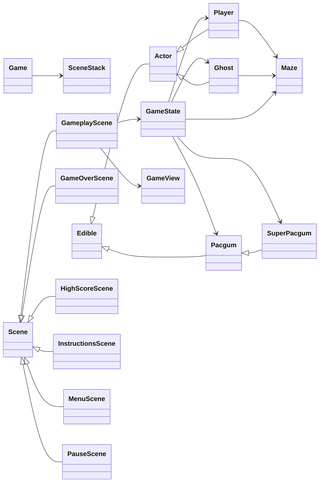

# Code map

The game is a window driving a stack of screens. `Game` runs the
loop and owns the `SceneStack`; every screen is a `Scene`.
`GameplayScene` is the only one with a simulation behind it: it
owns a `GameState`, which holds the `Maze`, the `Player`, the
ghosts and the dots, and a `GameView` that draws them.

Everything the player can eat derives from `Edible`, everything
that moves from `Actor`. `GameState` never draws, and no entity
knows a scene exists.

Only the classes that carry the structure are shown. Enums,
exceptions, pydantic models and small value types are left out.

