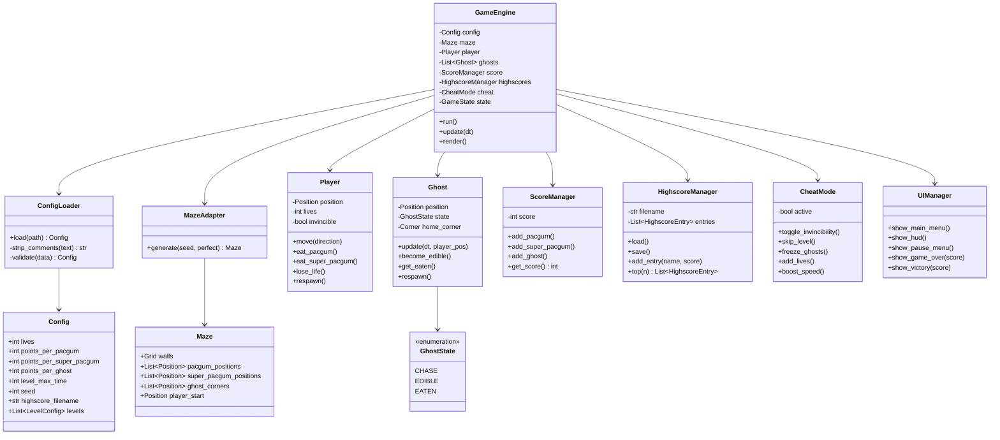

# Software Architecture

> Status: draft.

## 1. Module overview

| Module | Owner | Responsibility |
|---|---|---|
| `config/` | Semere | Parse JSON-with-comments config, validate, apply safe defaults |
| `maze/` | | Adapter around the assigned A-Maze-ing package; exposes a stable internal `Maze` representation |
| `engine/` | | Main loop, timestep, rendering entrypoint |
| `entities/` | Lucas | `Player`, `Ghost`, `PacGum`, `SuperPacGum` |
| `scoring/` | | Score tracking + highscore persistence |
| `ui/` | | Main menu, HUD, pause menu, game-over/victory screens |
| `cheat/` | | Cheat mode toggle + feature set |

Each module should only depend on the modules below it in this table where
possible — e.g. `ui/` reads from `scoring/` and `entities/`, but `entities/`
should not import anything from `ui/`.

## 2. Class diagram

## 3. Design notes / open decisions

- **Ghost behavior strategy**: consider a `Strategy` pattern so `chase`,
  `flee`, and `eaten` movement logic are swappable per-ghost rather than
  branching inside `Ghost.update()`. Not required, but keeps `GHO-02`/`GHO-03`
  testable in isolation.
- **`MazeAdapter` boundary**: this is the one class allowed to know about the
  external A-Maze-ing package's actual interface (per subject V.4 — "your
  loader must adapt to their interface"). Nothing else in the codebase should
  import that package directly — route everything through `MazeAdapter` so a
  package API change only touches one file.
- **Config immutability**: once loaded, treat `Config` as read-only for the
  rest of the run — avoids accidental state bugs from something mutating
  config mid-game.

## 4. Why this shape

Rough justification for anyone reading this cold (or for defense purposes):
`GameEngine` is the only class that knows about everything else — every other
class is testable independently without spinning up the full engine, which is
what `TEST-01`'s unit tests rely on.
