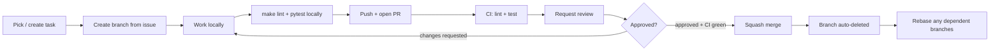

# Collaboration Workflow

> Status: living document — update as the workflow evolves.

Default epic ownership (adjust per week if load isn't balanced):

| Dev | Owns |
|---|---|
| Semere | `engine`, `player`, `ghosts`, `cheat`, `maze` |
| Lucas | `config`, `scoring`, `ui`, `packaging`, `docs` |

Anyone can pick up any unblocked ticket if the owner is unavailable —
ownership is a default, not a lock.

## Pipeline overview



## 1. Pick or create a task

- Check the GitHub Project board's **To Do** column first.
- Prefer tickets in your default epic (table above), but grab anything
  unblocked if you're free and your usual epic is waiting on someone else.
- **Check "Depends on"** on the ticket — if the dependency isn't merged to
  `main` yet, don't start; either help unblock it or pick something else.
- Assign yourself and move the card to **In Progress** before starting, so
  the board reflects reality.

If the work isn't already ticketed (new idea, or a bug you just found):
use the **Task** or **Bug report** issue template (see [Templates](#templates)
below), label it (`epic:*`, `week-*`, `bug` if applicable), and add it to
the board before writing any code.

## 2. Create the branch

From the issue's **Development** section → **Create a branch** (accept the
suggested name, or type your own in the field before confirming — see the
branch-naming notes elsewhere in this doc history if you need a custom one).

```bash
git fetch origin
git checkout <branch-name>
```

## 3. Do the work

- Keep commits small and scoped to one logical change. Commit message
  convention: `<TICKET-ID>: short description` (e.g. `GHO-03: add edible timer`).
- **One bug/root cause per branch and PR** — even if you find several
  issues in one sitting, split them (`git add -p` if they're tangled in the
  same working tree). See the bug-handling convention already established
  for this project.
- Keep the branch short-lived. If it's drifting because `main` moved on:
  ```bash
  git fetch origin
  git rebase origin/main
  ```
- Before pushing, run locally what CI will run, so you're not waiting on
  a red check to find out:
  ```bash
  make lint-strict
  make test
  ```

## 4. Open the PR

Use the PR template (auto-filled by GitHub). Key points:
- Title: `<TICKET-ID>: short description` — matches the branch/commit style.
- Body includes `Fixes #<issue-number>` so merging auto-closes the issue.
- PR targets `main`.
- Fill in the testing checklist honestly — an unchecked box is a signal to
  the reviewer, not something to fake-check.

## 5. Let CI run

Both `lint (ruff, flake8 + mypy)` and `test (pytest)` must pass before merge is
even reviewable in good faith. If either fails, push a fix — CI reruns
automatically on new commits to the same branch.

## 6. Review

- Self-approval isn't advised — request review from the other dev.
- Reviewer checks: does it satisfy the ticket's acceptance criteria? Does
  it match `docs/design/architecture.md`? Any obvious regressions?
- Use **Comment** for questions, **Request changes** for blocking issues,
  **Approve** once satisfied.
- Address feedback with new commits on the same branch. Avoid force-pushing
  mid-review unless necessary (rewriting history mid-review resets the
  reviewer's diff view) — if you must, give the reviewer a heads-up.

## 7. Merge

- **Squash merge** once approved and CI is green — keeps `main`'s history
  as one commit per ticket.
- Branch auto-deletes on merge (repo setting already enabled).
- Confirm the linked issue auto-closed and the board card moved to **Done**.

## 8. After merging

- If you (or your teammate) have another branch depending on what just
  landed, rebase it onto the updated `main`:
  ```bash
  git fetch origin
  git rebase origin/main
  ```
- If the change affects config shape, architecture, or game-design
  decisions, update the relevant file in `docs/design/` in the same PR or
  immediately after — don't let docs drift from what actually shipped.

## Templates

- Issue — Task: `.github/ISSUE_TEMPLATE/task.md`
- Issue — Bug report: `.github/ISSUE_TEMPLATE/bug_report.md`
- Pull request: `.github/PULL_REQUEST_TEMPLATE.md`

## Quick reference

```bash
# Start a ticket
git fetch origin && git checkout <branch-name>

# Before pushing
make lint-strict && make test

# Keep branch current
git fetch origin && git rebase origin/main

# After a dependency merges
git fetch origin && git rebase origin/main
```
