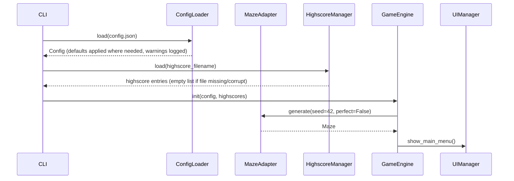
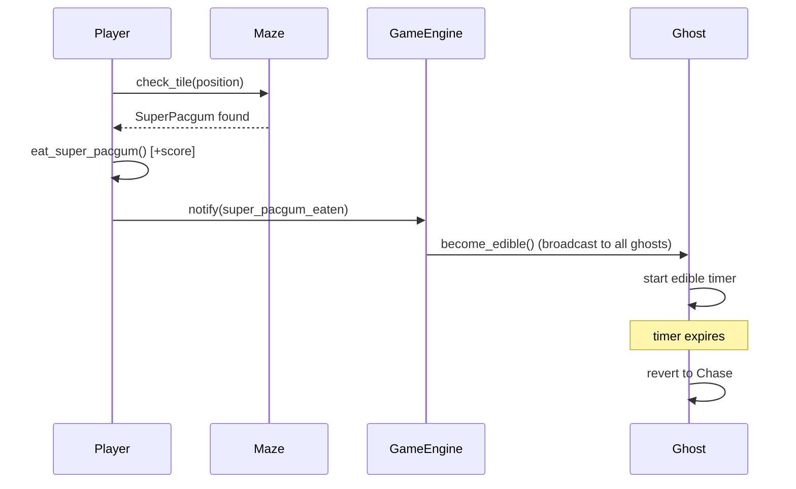
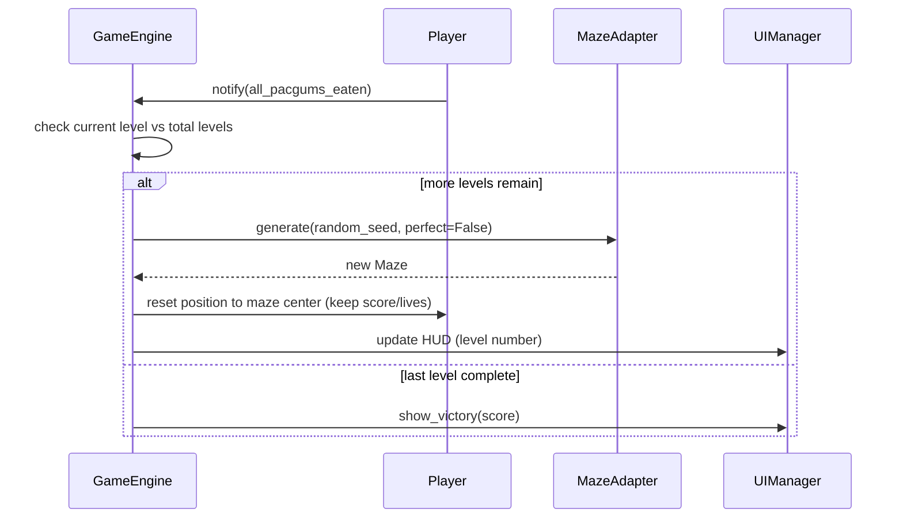
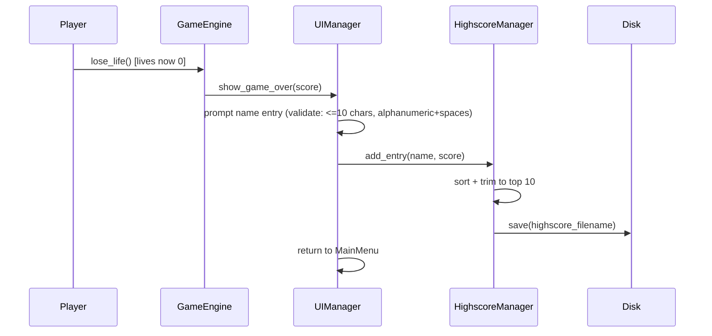
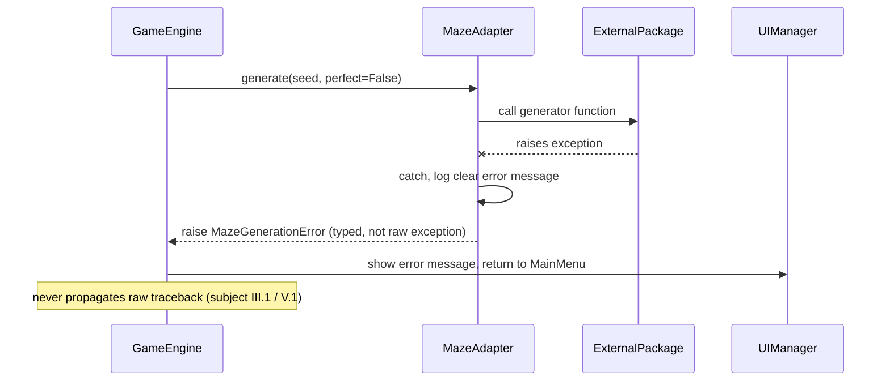

# Sequence Diagrams

> Status: draft.

## 1. Startup sequence

Relevant tickets: `CFG-01`–`CFG-03`, `MAZE-02`–`MAZE-03`, `UI-01`.

## 2. Eating a super-pacgum

Relevant tickets: `PLR-02`, `GHO-03`.

## 3. Level transition

Relevant tickets: `PROG-01`, `PROG-02`.

## 4. Game over / highscore save

Relevant tickets: `SCORE-02`–`SCORE-04`, `UI-04`.

## 5. Maze generator failure (error path)

Relevant tickets: `MAZE-04`.
