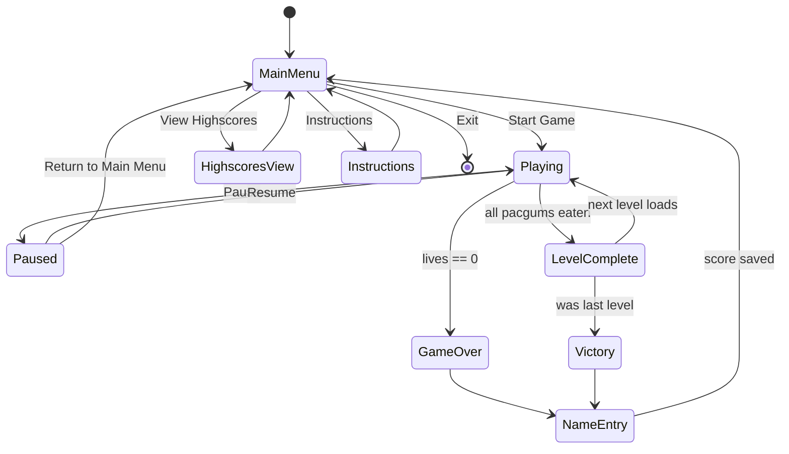
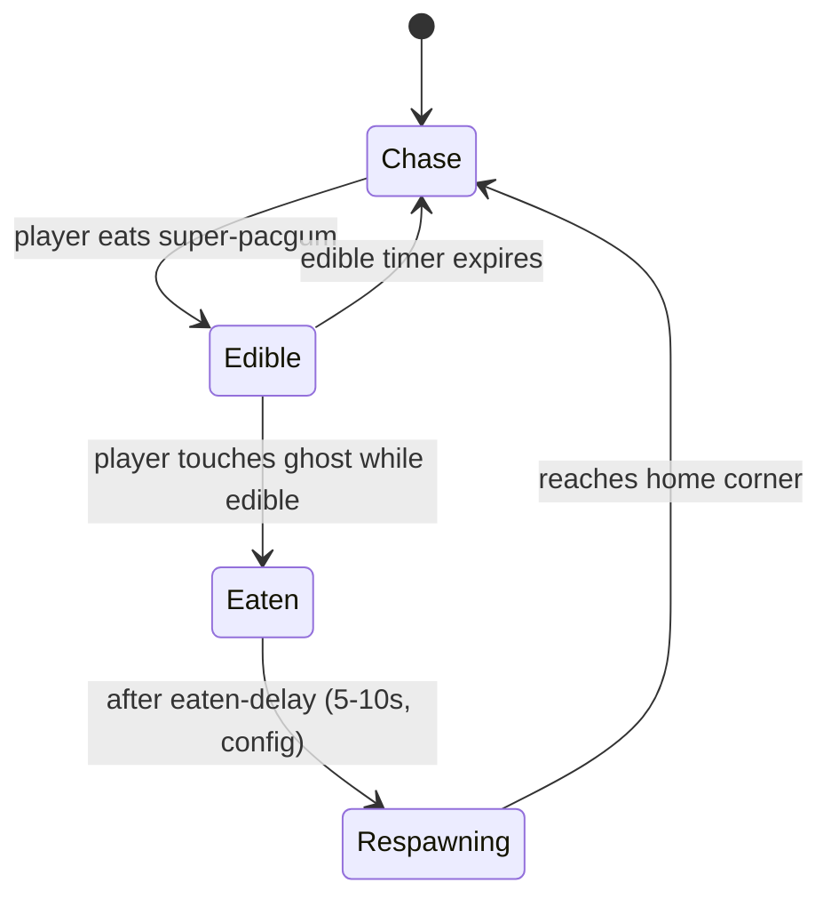
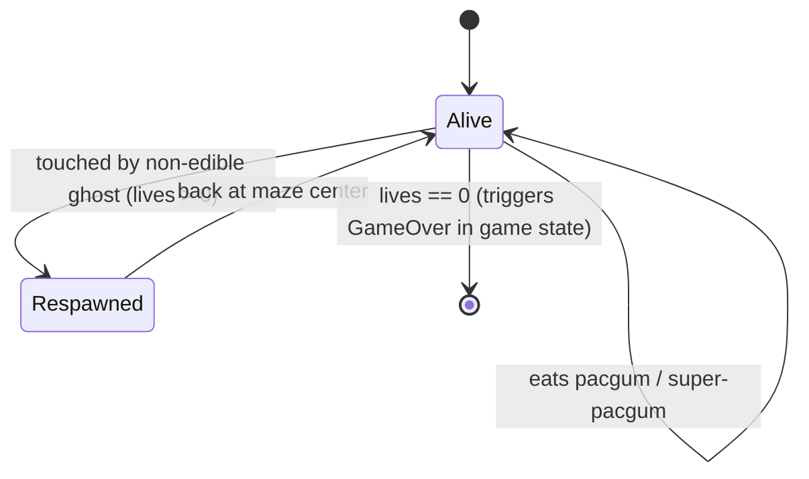

# State Machines

> Status: draft.

## 1. Game state (UI flow)

Matches the mandatory Game Loop from Chapter IV:
`Main Menu > start game > Win or Lose > Enter name for highscore > Back to Main Menu`

### Notes
- `LevelComplete` is a brief transitional state (load next maze, reset
  player position, keep score/lives) rather than a screen — decide during
  implementation whether it needs any visible UI or just a short pause.
- Time-limit-reached behavior (subject VI.7: "you can decide what happens")
  isn't drawn here yet — pick one (`restart level` vs `end game`) and add a
  transition from `Playing` once decided. Document the choice in
  `docs/project-management/project-analysis.md`.

## 2. Ghost state

### Notes
- **Chase**: default behavior, per subject VI.3 — chase logic is
  implementation-defined (distance-based, random, pathing). Document whichever
  is chosen in the architecture doc's "open decisions" section once settled.
- **Edible**: triggered globally for all ghosts simultaneously (per subject
  VI.4 — a super-pacgum affects all ghosts, not just one).
- **Eaten**: worth deciding whether an eaten ghost is fully removed from the
  board during `Respawning` or visually shown returning to its corner —
  either is fine, just needs to be consistent and documented.

## 3. Player state

Player mostly tracks as data (`lives`, `position`, `invincible`) rather than
a discrete state machine, but the life-loss/respawn cycle is worth noting:

