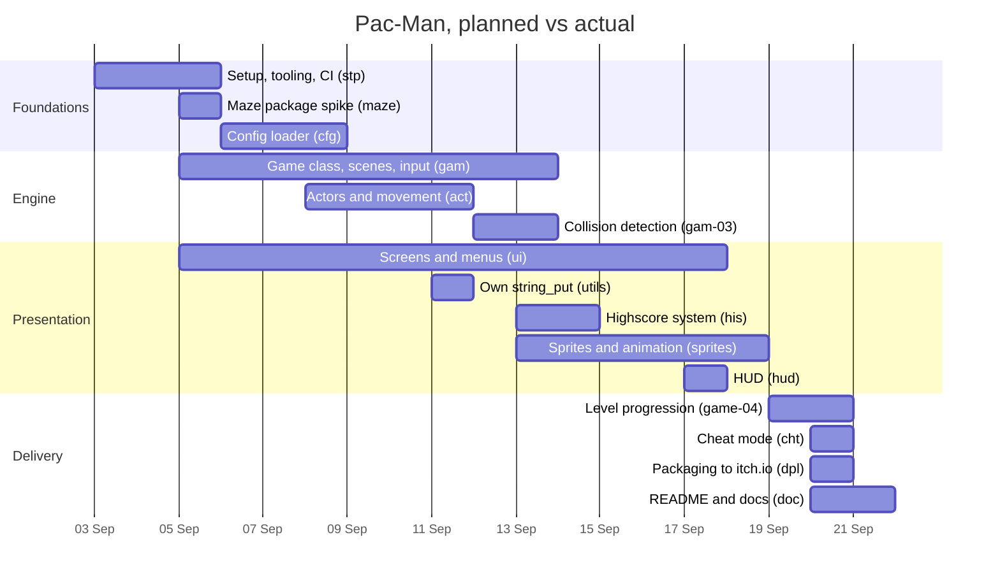

# Timeline and progress

Three weeks, 3–20 September 2026 on
[pacmania42/pacman](https://github.com/pacmania42/pacman).

## Plan

We split the subject into epics and gave each a short prefix, used in issue
titles, branch names and commit messages. Work was pulled from the top of the
board's Ready column, so the plan below is the order we intended, not fixed
dates.

## What actually happened

| Week | Planned | Delivered |
|---|---|---|
| W36 (3–6 Sep) | tooling, maze spike, config | all three, plus the first menu screen and the game-state skeleton |
| W37 (7–13 Sep) | actors, collision, first sprites | done; `UTILS-00` (own `string_put`) was added mid-week once we found MLX had no text output |
| W38 (14–20 Sep) | screens, HUD, progression, packaging | done, but compressed: most of the project's work falls in this week |

## Throughput

The board's Done column moved steadily: work was reviewed
each evening. The largest bursts was mid-week three, when most of the
presentation layer landed together.

### Where we drifted

- **Back-loaded.** More than half the work landed in the last week. The engine
  took longer than planned, so progression, cheat mode and packaging were all
  finished in the final two days.
- **`UTILS-00` was unplanned.** MLX has no text drawing, so we had to write a
  bitmap-font renderer before any screen could show a score. One day, not in
  the original plan.
- **Bug epics were not planned at all.** The `BUG` tickets were opened
  reactively.
- **Late tickets** are deployment, documentation and the final fixes. They are the tail of the
  back-loading above, not forgotten work.
