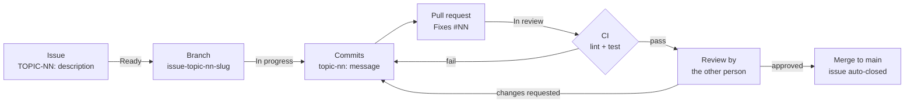

# Team organization

Two people, no formal roles. We split the codebase along a seam that already
existed in the architecture: the **simulation** and everything that **presents**
it.

## Who did what

Ownership is recorded by the assignee on each issue.

| Area | Issues | Owner |
|---|---|---|
| Project scaffolding, tooling, CI | `STP-00` | semebrah |
| Config loader and validation | `CFG-00` | semebrah |
| Maze package integration | `MAZE-01` | semebrah |
| Actor, Player, Ghost classes | `ACT-00`, `ACT-01`, `ACT-02` | semebrah |
| Game class and game states | `GAM-00` | semebrah |
| Collision detection | `GAM-03` | semebrah |
| Level progression, timeout | `GAM-04`, `GAME-05` | semebrah |
| Cheat mode | `CHT-00` | semebrah |
| Packaging and deployment | `DPL-00`, `DPL-01` | semebrah |
| Scene manager and view states | `GAM-01` | strambus |
| Input handling architecture | `GAM-02` | strambus |
| Screens: menu, pause, game over, victory, instructions | `UI-00` … `UI-05` | strambus |
| HUD | `HUD-00`, `UI-06` | strambus |
| Bitmap font renderer (`string_put`) | `UTILS-00` | strambus |
| Sprites and animation | `SPRITES-00` … `SPRITES-04` | strambus |
| Highscore system and view | `HIS-00`, `HIS-01` | strambus |
| Ghost chase strategies | `GHOST-00`, `GHOST-01` | strambus |
| README and project documents | `DOC-00` … `DOC-02` | strambus |

The seam held for the whole project: `src/entities/` and `src/core/config.py`
are almost entirely semebrah's, `src/ui/` and `src/scenes/` almost entirely
strambus's. That convention is why `GameState` contains no drawing code, it
began as a way to avoid conflicts and became the main architectural rule.

## The board

We ran a [GitHub Projects](https://github.com/pacmania42/pacman/issues) board
with five columns, with issues and pull requests linked to it so GitHub moved
cards automatically as work progressed.

> The board itself is private to the organization,
> the issues and pull requests it tracks are public.

| Column | Means |
|---|---|
| Backlog | written down, not yet scheduled |
| Ready | scoped, acceptance criteria agreed, free to pick up |
| In progress | someone is working on it, branch cut |
| In review | pull request open, waiting on the other person |
| Done | merged to `main`, issue closed by the PR |

Most of the backlog was written in a single grooming session on the second day,
straight from the subject. The rest was added as we discovered it, which is why
the board kept a real backlog rather than becoming a to-do list we drained
once.

## How work flowed



Every piece of work starts as an issue using
[the task template](../.github/ISSUE_TEMPLATE/task.md), which forces a
description, acceptance criteria and dependencies. Issues are titled with their
epic prefix (`UI-02: Screen - Game Over`), and the branch carries both the issue
number and that prefix, so `git branch` alone shows what is in flight:

```
20-ui-02-screen---game-over
51-bug-02-levels-other-than-1-must-use-a-random-seed
```

Issues are kept small, one screen, one system, one bug class. The biggest
epics are the ones with the most surface: `UI`, `GAM` and `SPRITES`.

## Reviews

Nothing reaches `main` except through a pull request using
[the PR template](../.github/PULL_REQUEST_TEMPLATE.md), which requires a linked
issue and a confirmation that `make lint` and `make test` pass locally.
[CI](../.github/workflows/ci.yml) runs both again on every pull request, so a
red build blocks the merge regardless of what the author ticked.

The discipline held all the way through. Every pull request used the template
and, bar one refactor, linked its issue with `Fixes #` so the merge closed the
ticket. No one merged their own work: every merged pull request was reviewed by
the other person, most approved outright, a few sent back for changes.

Reviews were always cross-area: whoever did not write the code reviewed it.
That was deliberate, with the file split, review was the only thing keeping
each of us familiar with the other's half.

Design decisions were made in the issue thread before the branch was cut, so
the reasoning sits next to the work. The larger ones are recorded in
[analysis-and-risks.md](analysis-and-risks.md).
